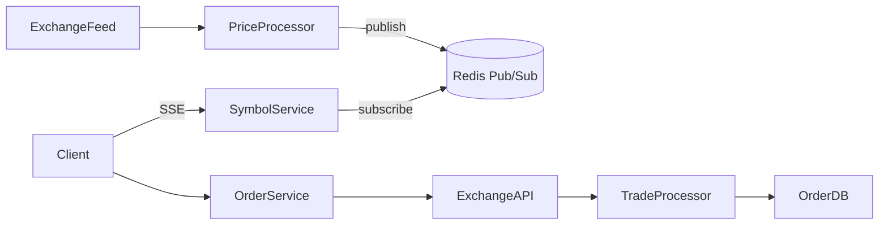
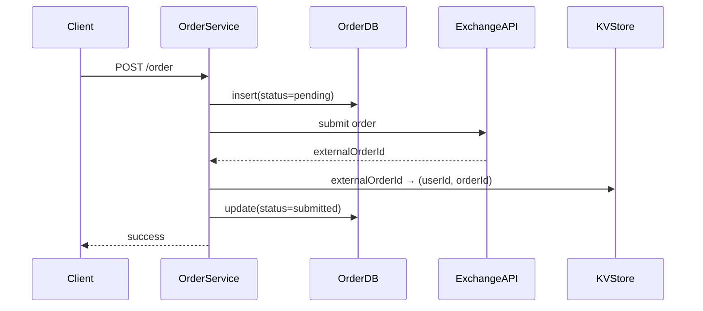
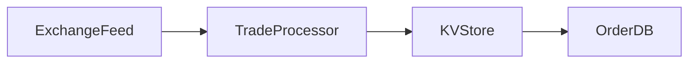
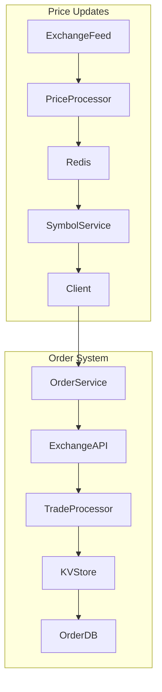

# 📘 Robinhood System Design (Senior-Level, 10–15 min Version)

## 🎯 1. Problem Scope

Design a simplified Robinhood-like trading platform that supports:

### **Functional Requirements**

* Live stock prices (low latency, scalable)
* Order management:

  * Create market/limit orders
  * Cancel orders
  * List all orders for a user

### **Non-Functional Requirements**

* Strong consistency for orders
* Low-latency price propagation (< 200 ms)
* High scale: 20M DAUs, thousands of symbols
* Minimize direct exchange connections

---

# 🧱 2. Core Entities

```
User
Symbol
Order (market | limit)
Trade (from exchange feed)
```

---

# 📡 3. APIs

### **Price Subscription**

```
POST /subscribe
Body: { symbols: ["META", "AAPL"] }
Response: SSE stream
```

### **Create Order**

```
POST /order
Body: {
  type: "market" | "limit",
  symbol: "META",
  priceInCents: 52210,
  numShares: 10
}
```

### **Cancel Order**

```
DELETE /order/:id
```

### **List Orders**

```
GET /orders
```

Notes:

* Use integers (`priceInCents`) to avoid float precision issues.
* Auth via headers/JWT.

---

# 🏗️ 4. High-Level Architecture



---

# 🟦 5. Live Price Streaming (MAIN PATTERN)

### ❌ Option 1: Client → Exchange polling

Too many connections, wasteful, slow.

### ❌ Option 2: Client → Internal polling

Better but still inefficient + latency tied to polling interval.

### ✅ **Great Solution: SSE + Redis Pub/Sub**

### **Flow**

1. Client calls `/subscribe` with list of symbols.
2. SymbolService:

   * stores `symbol → set(users)`
   * subscribes to Redis channels as needed
3. ExchangeFeed publishes price updates → PriceProcessor → Redis
4. SymbolService fans out to clients via SSE

### **Why SSE?**

* Perfect for one-way streaming
* Built-in auto-reconnect
* Lightweight vs WebSockets
* No need for duplex communication

---

# 🟩 6. Order Placement Workflow



### Why write `pending` before calling the exchange?

To ensure user-visible consistency even if we crash.

---

# 🟫 7. Order Updates (Trade Fills)

### Architecture



### Flow

1. Exchange emits trade (fill/partial fill/cancel).
2. TradeProcessor reads event.
3. Looks up `(userId, orderId)` in KV store.
4. Updates the correct shard in OrderDB.

### Why KV Store?

Because OrderDB is partitioned by `userId`,
and we cannot query `externalOrderId` globally across shards.

Good options:

* RocksDB (embedded, durable, fast)
* DynamoDB
* Redis (only if AOF or snapshotting enabled)

---

# 🟪 8. Consistency & Failure Handling

### **Create Order Failures**

| Failure                                | Handling                                                 |
| -------------------------------------- | -------------------------------------------------------- |
| DB insert fails                        | Return error                                             |
| Exchange submit fails                  | Mark order failed                                        |
| DB update fails after exchange success | Cleanup job reconciles with exchange using clientOrderId |

### **Cancel Order Failures**

| Failure                        | Handling                           |
| ------------------------------ | ---------------------------------- |
| DB cannot set `pending_cancel` | Return error                       |
| Exchange cancel fails          | Mark failed + cleanup job          |
| DB update fails                | Cleanup job validates via exchange |

### Cleanup Job Responsibilities

* Scan `pending` and `pending_cancel`
* Query exchange using `clientOrderId` (metadata)
* Fix state in OrderDB

---

# 🟧 9. Key Tradeoffs Summary

### **Real-time Prices**

| Design          | Verdict                    |
| --------------- | -------------------------- |
| Poll Exchange   | ❌ Too many calls           |
| Poll Internal   | ❌ Latency + waste          |
| **SSE + Redis** | ✅ Best for scale + latency |

### **Order Dispatch**

| Option                         | Verdict                       |
| ------------------------------ | ----------------------------- |
| Direct client → exchange       | ❌ Too many connections        |
| Queue-based dispatch           | ❌ Latency spikes during peak  |
| **OrderService + NAT gateway** | ✅ Low latency, simple, secure |

---

# 🟦 10. Final Architecture Overview



---

# 🎤 Interview Tips (Senior-Level)

* Talk **latency constraints** early (sub-200ms updates).
* Emphasize **SSE > WebSockets** specifically because the client only receives data.
* Hit the **consistency story** strongly—pending → submitted → cleanup job.
* Explain why **KV store solves cross-shard lookup**.
* Mention **horizontal scaling** for SymbolService + OrderService.

---

If you want, I can also generate:
✅ **Staff-level version**
✅ **Mid-level simplified version**
✅ **HTML dashboard version**
